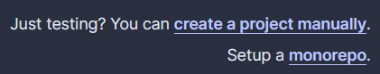

# Setup

This part of the guide will get your environment set up for running an action plan.

## TruStacks Setup

TruStacks requires [docker](https://www.docker.com/) to run action plans and [age](https://github.com/FiloSottile/age/releases) for input encryption at rest.

Follow the instructions below to get those tools installed and configured.

### CLI

Download the latest TruStacks cli binary [here](https://github.com/TruStacks/trustacks/releases/tag/v0.1.0)

Place the binary on your path and run the following command:

```
tsctl -h
```

The output should display the TruStacks cli usage:

```
Trustacks software delivery engine

Usage:
  tsctl [command]

Available Commands:
  completion  Generate the autocompletion script for the specified shell
  help        Help about any command
  login       login to trustacks
  plan        Generate an action plan
  run         Run an action plan
  server      start the api server
  stack       manage input stacks
  version     Show the cli version

Flags:
  -h, --help            help for tsctl
      --server string   rpc server host

Use "tsctl [command] --help" for more information about a command.
```
### Docker

Follow the instructions [here](https://docs.docker.com/engine/install/) to install docker on your machine.

<!---
#### Validate docker

Run the following command to validate your docker installation.

```
docker run -it quay.io/trustacks/tsctl:0.1.0 -h
```

The output should display the TruStacks cli usage:

```
Trustacks software delivery engine

Usage:
  tsctl [command]

Available Commands:
  completion  Generate the autocompletion script for the specified shell
  help        Help about any command
  login       login to trustacks
  plan        Generate an action plan
  run         Run an action plan
  server      start the api server
  stack       manage input stacks
  version     Show the cli version

Flags:
  -h, --help            help for tsctl
      --server string   rpc server host

Use "tsctl [command] --help" for more information about a command.
```

:::caution
TruStacks is not tested with other OCI runtimes such as podman or runc. They are not likely to work without additional modifications.
:::
-->

### Age

[Age](https://github.com/FiloSottile/age/releases) keys are used to encrypt [Stack Inputs](/stacks) at rest. Get the latest age release for your machine [here](https://github.com/FiloSottile/age/releases) and are not recommended.

#### Validate age

Run the following command to validate age:

```
age-keygen -h
```

The output should the age cli usage:

```
Usage:
    age-keygen [-o OUTPUT]
    age-keygen -y [-o OUTPUT] [INPUT]

Options:
    -o, --output OUTPUT       Write the result to the file at path OUTPUT.
    -y                        Convert an identity file to a recipients file.

age-keygen generates a new native X25519 key pair, and outputs it to
standard output or to the OUTPUT file.

If an OUTPUT file is specified, the public key is printed to standard error.
If OUTPUT already exists, it is not overwritten.

In -y mode, age-keygen reads an identity file from INPUT or from standard
input and writes the corresponding recipient(s) to OUTPUT or to standard
output, one per line, with no comments.
...
```

## Action Plan Setup

The sample app is a react application that will be deployed on kubernetes.

Follow the instructions below to configure the local k8s cluster and additional services for the action plan.

### k3d

#### Install

K3d deploys a rancher k3s cluster into a docker container, so you will need to have docker installed. Follow the [installation guide](https://k3d.io/#installation) to get k3d installed on your local machine.

#### Cluster Creation

Once k3d is installed, use the following command to create a cluster:

    k3d cluster create -p "50123:80@loadbalancer" trustacks

This command will create a new k3d cluster named `trustacks`. The `-p` option will create a loadbalancer on `8081`. This loadbalancer will be used later in the guide to access the toolchain components.

:::tip

If port `8081` is already in use on your machine then feel free to use a different port.

:::

Once the cluster is created check the output of `docker ps` and confirm that you have the `k3d-trustacks-serverlb` and `k3d-trustacks-server-0` containers.

    CONTAINER ID IMAGE                            COMMAND                  CREATED          STATUS          PORTS                                           NAMES
    3e0600614d9f ghcr.io/k3d-io/k3d-tools:5.4.3   "/app/k3d-tools noop"    27 seconds ago   Up 26 seconds                                                   k3d-trustacks-tools
    6b4aaee146ba ghcr.io/k3d-io/k3d-proxy:5.4.3   "/bin/sh -c nginx-pr…"   28 seconds ago   Up 19 seconds   0.0.0.0:8081->80/tcp, 0.0.0.0:44345->6443/tcp   k3d-trustacks-serverlb
    9eda9a6fc566 rancher/k3s:v1.23.6-k3s1         "/bin/k3s server --t…"   28 seconds ago   Up 24 seconds                                                   k3d-trustacks-server-0

Run the following command to confirm that the kubectl client was installed and that the cluster api is healthy:

    kubectl get ns

The command should return the following output:

    NAME              STATUS   AGE
    kube-system       Active   20s
    default           Active   20s
    kube-public       Active   20s
    kube-node-lease   Active   20s

### SonarCloud

Sign up for a [SonarCloud](https://sonarcloud.io) account.

After signing up, click the <button className="TrustacksSonarcloudNewButton">+</button> at the top right of the page and select **Analyze new project**

On the Analyze projects page click **create a project manually** in the second to the right.



If you have a new SonarCloud and you have not created an organization, under the `Organization` drop-down, click **Create another organization**. Create an organization with your desired name.

After being redirected back to the Analyze projects page, enter the **Display Name** `TruStacks React Sample`. 

This will automatically generate a project key with the format `<organization>_trustacks-react-sample`.

Click **Next** to proceed.

On the next page select **Previous version** and then click **Create project**
